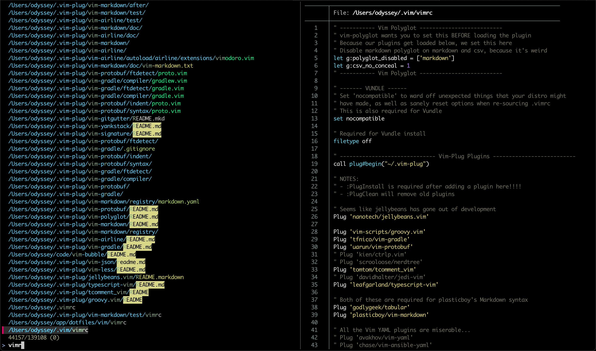
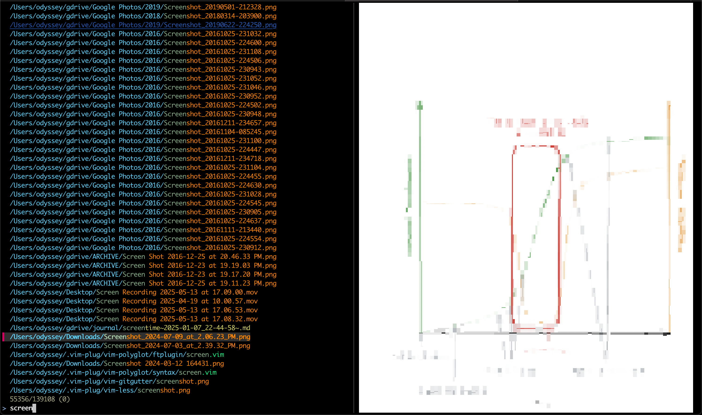

cmdk
====
The ⌘-k "access anything" shortcut is awesome on Notion, Slack, etc.

The terminal feels like a dinosaur in comparison: tons of repeated `cd` and `ls` and `TAB` just to get anything done.

This is ⌘-k for the terminal: access anything on your filesystem, from anywhere, with previews before you open:





Based on what you choose...

- Directories get `cd`d to
- Text files get opened in Vim
- Images and PDFs get opened in the Preview app
- `.key` files get opened in Keynote

_**Huge** thanks to [fzf](https://github.com/junegunn/fzf). I've been fed up with terminal navigation for a decade, and discovering fzf was the last piece needed to make this project possible._

Installation
------------
1. ```sh
   brew install fzf fd bat tiv
   ```
2. ```sh
   git clone git@github.com:mieubrisse/cmdk.git ~/.cmdk
   ```
3. Add to your `.zshrc` or `.bashrc`:
   ```sh
   source ~/.cmdk/cmdk.sh
   ```
4. Bind the `⌘-k` hotkey to send the text `cmdk\n` in your terminal
   > 💡 In iTerm, this is done with `Settings → Profiles → Keys → Keybindings → + → Send Text`, then binding `⌘-k` to send the text `cmdk\n`
5. Open a new shell

Usage
-----
Press ⌘-k (or type `cmdk`) and...

- Type to start filtering
- `Ctrl-j` and `Ctrl-k` to scroll up and down the results list
- `ENTER` to select the result
- `TAB` to select multiple items before `ENTER`
- `Ctrl-u` to clear the selection

> ⚠️ Some directories like `Library`, `/`, and `.git` are full of stuff users don't need to access, so their contents are excluded. To get to their contents, first ⌘-k to them and then ⌘-k again to see their contents.
